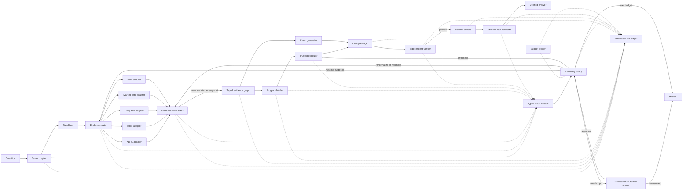

# V3 proposal: a verifiable financial-research runtime

## Status

This document is a design proposal and migration plan. The repository does not
yet implement the complete v3 system, and no v3 benchmark result is claimed.
The implemented `gap_driven_v2` runtime remains the default experimental
system; `paper_fixed` remains the historical paper baseline.

The proposed research claim is:

> A typed evidence graph and failure-localized controller can decide when to
> retrieve, reconcile, recompute, or abstain more reliably and efficiently than
> blind full-pipeline retry under a matched inference budget.

A possible paper title is **When to Retrieve, Recompute, or Abstain:
Evidence-Gap Repair for Verifiable Financial QA**.

## Why a v3 boundary is needed

V2 makes calculated answers inspectable: it compiles trusted formulas, binds
operands to evidence, executes with `Decimal`, and maps verifier issues to
specific recovery actions. Its remaining weaknesses are mostly below and
around that calculation layer:

- flattened text cannot establish true table row and column identity;
- retrieval treats heterogeneous sources as document chunks rather than typed
  financial facts;
- filing period, filing date, publication date, and allowed as-of time are not
  modeled together;
- contradictory values can be detected but are not represented as a durable
  conflict set with an explicit resolution rule;
- the correction policy is not calibrated against expected quality gain,
  dollars, tokens, or latency;
- qualitative claims do not have the same assurance level as typed
  calculations.

V3 addresses these boundaries without relabeling inference-time correction as
online learning or adding a loosely coordinated agent swarm.

The specific seam to replace is:

```text
List[Document] -> model-authored operand values
```

V3 instead normalizes sources into immutable evidence records and binds the
already trusted expression tree to stable numeric fact IDs. A model may
nominate a relevant evidence or fact ID or draft an explanation, but it does
not get to rewrite the value stored under that ID.

## Design principles

1. **One controller, typed tools.** A single state machine owns budgets,
   terminal decisions, and the final answer. Source adapters and calculators
   are tools with explicit contracts, not independent conversational agents.
2. **Structured sources before text when the question permits.** XBRL facts
   and table cells should be preferred for canonical reported quantities;
   filing prose remains necessary for explanations, policies, and management
   commentary.
3. **Models propose; deterministic components constrain.** Models may map
   ambiguous language, select evidence, and draft explanations. They may not
   silently change entity, time, unit, formula, source, or budget constraints.
4. **Preserve disagreement.** Conflicting facts are stored together and linked;
   one value must not overwrite another merely because it ranked higher.
5. **Assurance is compositional.** Evidence validity, arithmetic validity,
   answer correctness, and source authority remain separate fields rather than
   one generic confidence score.
6. **Fail closed at the contract boundary.** Unsupported formulas, unresolved
   periods, missing provenance, and exhausted budgets produce explicit
   abstention or human-review states.
7. **Every result is replayable.** The run ledger contains enough immutable
   inputs and outputs to recompute deterministic decisions without calling a
   model or retrieval API again.

## Logical architecture

The full system drawing emphasizes the runtime's three planes: an immutable
`TaskSpec` control plane, typed evidence and deterministic verification on the
main path, and a budgeted correction plane that repairs only the failed
condition. Click the preview for the full-resolution diagram, or open the
editable source to change it.

[Open full-resolution PNG](assets/v3-system-design.png) ·
[Open editable Excalidraw source](assets/v3-system-design.excalidraw)

[](assets/v3-system-design.png)

The Mermaid view below is the compact, text-native component map.



The diagram describes logical boundaries. The initial implementation should be
a modular Python application with ports and adapters, not separate networked
microservices. A graph database is also unnecessary: the evidence graph can be
represented by typed records and explicit relation tables in memory, JSONL,
Parquet, SQLite, or PostgreSQL. Storage can change without changing domain
contracts.

## Core contracts

### 1. `TaskSpec`

The task compiler converts the user question into the constraints that every
downstream component must obey.

```json
{
  "task_id": "task:sha256:...",
  "question": "What was ACME's FY2024 operating margin?",
  "entities": [{"entity_id": "cik:0000000000", "name": "ACME"}],
  "periods": [{"kind": "fiscal_year", "label": "FY2024"}],
  "as_of": "2025-02-15T23:59:59Z",
  "answer_contract": {
    "metric": "operating_margin",
    "unit": "percent",
    "rounding": {"places": 1}
  },
  "formula_id": "operating_income_margin",
  "evidence_needs": [
    {
      "need_id": "task:sha256:...:need:operating_income",
      "entity_id": "cik:0000000000",
      "metric": "operating_income",
      "period": "FY2024",
      "quantity_kind": "money",
      "currency": "USD",
      "source_capabilities": ["numeric_fact", "table_cell"],
      "source_hints": ["10-K"],
      "required": true
    },
    {
      "need_id": "task:sha256:...:need:revenue",
      "entity_id": "cik:0000000000",
      "metric": "revenue",
      "period": "FY2024",
      "quantity_kind": "money",
      "currency": "USD",
      "source_capabilities": ["numeric_fact", "table_cell"],
      "source_hints": ["10-K"],
      "required": true
    }
  ],
  "unresolved_constraints": [],
  "risk_class": "reported_financial_calculation"
}
```

Required properties:

- entity IDs are canonical and distinct from display names;
- fiscal periods and calendar dates are not interchangeable;
- `as_of` is mandatory. If the user omits it, the request-received timestamp in
  UTC becomes the recorded default; sources are eligible only when
  `available_at <= as_of` at the declared timestamp precision;
- an unsupported derived request remains marked as derived and unresolved;
- automated contract revisions may canonicalize aliases or deterministically
  narrow equivalent constraints. A material change to entity, formula, period,
  or as-of semantics requires user approval or abstention, recorded in an
  immutable contract-revision event.

### 2. Evidence records and source snapshots

Every retrieved item is normalized into a discriminated union with a universal
`evidence_id`:

- `NumericFactRecord` for a typed financial quantity, with an additional
  `fact_id` used by programs;
- `TableCellRecord` for a located row/column/header cell that may or may not yet
  be normalized to a financial fact;
- `ProseSpanRecord` for a bounded qualitative passage with no invented numeric
  subject or quantity fields.

Stable citations use `evidence_id`; only typed numeric facts use `fact_id`. The
logical contract is composed from:

- `SourceSnapshot`: immutable source identity, availability times, content
  hash, and parser/index/adapter versions;
- `EvidenceSpan`: a stable text span, table cell coordinate, or XBRL
  concept/context locator;
- `FinancialFact`: canonical entity, metric, value, unit, time, dimensions, and
  a pointer to the source span while retaining the original label and value.

```json
{
  "type": "numeric_fact",
  "evidence_id": "evidence:sha256:...",
  "fact_id": "fact:sha256:...",
  "source_snapshot_id": "source:sha256:...",
  "source": {
    "kind": "sec_xbrl",
    "uri": "https://www.sec.gov/Archives/...",
    "accession": "0000000000-25-000001",
    "form": "10-K",
    "filed_at": "2025-02-10T00:00:00Z",
    "available_at": "2025-02-10T00:00:00Z",
    "retrieved_at": "2026-08-31T00:00:00Z"
  },
  "subject": {
    "entity_id": "cik:0000000000",
    "metric": "us-gaap:OperatingIncomeLoss",
    "original_label": "Operating income"
  },
  "time": {
    "period_kind": "duration",
    "period_start": "2024-01-01",
    "period_end": "2024-12-31",
    "published_at": "2025-02-10T00:00:00Z",
    "observed_at": null
  },
  "quantity": {
    "kind": "money",
    "value_canonical": "1250000000",
    "value_original": "1,250",
    "currency": "USD",
    "source_unit": "USD",
    "presentation_scale": "million",
    "decimals": "-6",
    "dimensions": []
  },
  "locator": {
    "xbrl_context_id": "context-2024",
    "statement": "Consolidated Statements of Operations",
    "row": "Operating income",
    "column": "2024",
    "page": 71
  },
  "hashes": {
    "source_bytes_sha256": "...",
    "locator_sha256": "...",
    "normalized_record_sha256": "..."
  },
  "adapter": {
    "name": "sec_xbrl",
    "version": "1",
    "parser_version": "1",
    "normalizer_version": "1"
  }
}
```

Rules:

- every evidence variant has a stable `evidence_id`; numeric facts additionally
  have a `fact_id` derived from canonical semantic fields;
- source snapshot identity is separate from fact identity so several facts can
  share one immutable filing or page;
- original source values are immutable; normalizations are stored separately;
- the source URI, accession or equivalent identifier, retrieval time, adapter
  version, and content hash are mandatory for full assurance;
- quantity kind, currency, source unit, canonical value, and presentation scale
  remain separate so display formatting cannot change arithmetic;
- XBRL context, dimensions, instant-versus-duration semantics, and original
  concepts remain available for verification;
- `source_bytes_sha256` hashes retrieved source bytes and excludes volatile
  retrieval metadata; `locator_sha256` identifies the source span or cell;
  `normalized_record_sha256` includes the schema/normalizer version and all
  semantic fields, including XBRL context and dimensions;
- `retrieved_at`, request IDs, and transient ranks are observation metadata and
  do not change stable source or fact identity;
- missing fields remain `null`; adapters must not manufacture provenance;
- retrieved text is untrusted data and cannot issue instructions to the
  controller or tools.

### 3. `EvidenceGraph`

Terminology is fixed as follows:

- `EvidenceGraph` is the logical schema of evidence nodes and relations;
- `EvidenceBundle` is the task-scoped collection assembled for one attempt;
- `EvidenceSnapshot` is an immutable, serialized, content-addressed version of
  one bundle.

The pre-generation graph contains evidence records and evidence-to-evidence or
need-to-evidence relations only:

- `same_metric(fact_a, fact_b)`;
- `restates(fact_new, fact_old)`;
- `contradicts(fact_a, fact_b, reason)`;
- `supersedes(fact_new, fact_old, effective_at)`;
- `same_source_span(fact_a, fact_b)`;
- `covers(need_id, evidence_id)`.

Contradictions are first-class objects. Resolution produces a new decision
record with a rule and rationale; it never deletes the losing fact. The graph
must be serializable and content-addressed so a verifier can operate on the
exact snapshot used for generation. Every snapshot also reports coverage per
`EvidenceNeed`; a large graph is not equivalent to complete evidence.

A `FactConflictSet` groups comparable competing facts and records its status as
`unresolved`, `resolved_by_rule`, `resolved_by_model`, or `human_resolved`, plus
the selected fact when one exists.

### 4. Draft, verified, and rendered artifacts

The generator produces a `DraftPackage` with claims against stable evidence
IDs, not free-floating `Doc1` labels. A `ProgramBinder` resolves the trusted
AST's numeric evidence needs to facts and creates a `BoundProgram`; the values
come from those facts rather than from model-authored JSON. A draft contains:

- atomic claims and their supporting `evidence_id` values;
- the trusted finance program for derived quantities;
- the exact evidence-graph snapshot ID;
- declared entity, metric, period, unit, currency, and rounding;
- model/provider/request metadata.

Claim-support and result-derivation edges are stored in the draft or its answer
graph because claims and results do not exist when the evidence snapshot is
created. The verifier turns a passing draft into an immutable
`VerifiedArtifact`. Only then does the deterministic renderer create the
user-visible `RenderedAnswer`.

The current `<finance_program>` representation can remain as the calculation
payload during migration. A compatibility adapter may initially validate its
operand values against bound facts. The target state removes duplicated
model-authored operand values entirely and replaces positional document
references with stable fact identifiers.

### 5. `VerificationReport`

A verifier returns structured issues rather than one score:

```json
{
  "passed": false,
  "assurance_level": "typed_execution",
  "issues": [
    {
      "code": "operand_period_mismatch",
      "need_id": "revenue",
      "fact_id": "fact:sha256:...",
      "expected": "FY2024",
      "observed": "FY2023",
      "severity": "error"
    }
  ],
  "verified_claim_ids": [],
  "unverified_claim_ids": ["claim:operating_margin"]
}
```

Separate verifiers cover schema, source integrity, entity and time, units and
dimensions, program execution, claim attribution, contradictions, and budget
compliance. An optional semantic evaluator may emit an assessment or a
`missing_evidence` issue, but it cannot mutate the snapshot or fetch evidence.
Only the controller may initiate a separately budgeted and logged acquisition
transition. No semantic score can override a deterministic failure.

Adapter timeouts, rate limits, corrupted indexes, unavailable providers, and
artifact-store failures are infrastructure outcomes. They remain distinct from
`ABSTAIN`: an abstention is an intentional answer policy decision, while an
infrastructure error means the requested policy was not successfully executed.

#### Assurance and acceptance policy

Canonical assurance values are:

- `unverified`;
- `source_bound`: immutable source and locator checks passed;
- `claim_attributed`: qualitative claims are bound to supporting evidence;
- `typed_execution`: numeric facts and deterministic execution passed;
- `full_contract`: source, entity, time, metric, unit, formula, execution, and
  answer-contract checks passed.

These profiles are not one generic confidence score. Acceptance is an explicit
matrix keyed by risk class:

| Risk class | Minimum assurance | Allowed unresolved issues | Result |
|---|---|---|---|
| Qualitative explanation | `claim_attributed` | declared nonmaterial warnings | accept with citations |
| Reported numeric extraction | `full_contract` | none | accept |
| Derived financial calculation | `full_contract` | none | accept |
| Timestamped market value | `full_contract` plus observation-time check | none | accept |
| Material unresolved conflict | not applicable | conflict remains | human review or abstain |
| Unsupported or materially ambiguous contract | not applicable | constraint remains | clarification or abstain |

`resolved_by_model` does not satisfy a no-conflict requirement by itself. A
human resolution records reviewer identity, timestamp, rationale, selected
facts, and an immutable decision event. Projects may configure stricter
matrices, but every experiment must persist the exact policy version.

### 6. `RecoveryPlan`

The controller maps issues to the smallest action that could change the failed
condition:

| Issue | Default action | Reuse evidence? | New model call? |
|---|---|---:|---:|
| Missing fact or source type | targeted source retrieval | yes | only after retrieval |
| Wrong bound fact; eligible fact already exists | rebind program or claim | yes | no |
| Source-native parse or canonicalization error | renormalize and rebuild snapshot | source snapshot | no |
| No eligible fact for entity, period, or as-of time | constrained retrieval | yes | only after retrieval |
| Material task-contract error | authorized contract revision or clarification | no | optional |
| Conflicting facts | reconcile or request authoritative source | yes | optional |
| Wrong calculation result | local recompute | yes | no |
| Renderer failure after verification | fail infrastructure or deterministic retry | verified artifact | no |
| Wrong trusted formula | recompile through authorized contract revision | `EvidenceBundle` | no |
| Unsupported formula | abstain or approved formula extension | no | no |
| Qualitative attribution gap | retrieve prose evidence or abstain | yes | optional |
| Ambiguous task contract | compiler escalation or human clarification | no | optional |
| Repeated gap on unchanged graph | abstain | yes | no |
| Budget exhausted | abstain or human review | yes | no |
| Adapter/index/provider failure | bounded infrastructure retry or fail run | unchanged | no answer generation |

Every action consumes an explicit budget envelope:

```text
max_model_calls, max_tool_calls, max_input_tokens, max_output_tokens,
max_dollars, max_latency_ms
```

Each candidate `ActionProposal` records its affected issue and evidence needs,
estimated calls/tokens/dollars/latency, and anticipated gap reduction. A
`BudgetLedger` records reservations, actual usage, refunds, and hard remaining
limits; it is not merely a retry counter.

The first v3 policy should remain deterministic. A learned value policy is a
later, separately evaluated replacement that predicts expected correctness
gain per unit cost; it must not be trained and tested on the same questions.
Budget reservation and settlement must be atomic when tools run concurrently;
parallel calls cannot each spend the same remaining allowance.

The canonical action names are `RETRIEVE`, `REBIND`, `RENORMALIZE`,
`RECONCILE`, `RECOMPUTE`, `REVISE_CONTRACT`, `REQUEST_CLARIFICATION`,
`HUMAN_REVIEW`, and `ABSTAIN`. `REVISE_CONTRACT` invokes a real compiler
escalation path and the authorization rules in `TaskSpec`. Regenerating an
answer against unchanged formula and constraints is not replanning.

## Source routing and authority

There is no universal source ranking. The router chooses the source best suited
to the evidence need:

| Evidence need | Preferred source | Fallback |
|---|---|---|
| Reported statement value | SEC XBRL fact | structured filing table, filing text |
| Table row or column relationship | structured table cell | bounded table text |
| Management explanation or accounting policy | filing prose | earnings material, approved web source |
| Historical market observation | timestamped market-data API | exchange or issuer record |
| Publication or event claim | first-party dated web source | approved secondary source |

Authority and relevance are different dimensions. An XBRL fact may be
authoritative for a reported value but irrelevant to a causal explanation. A
web page may be timely but cannot replace a filing value without an explicit
reason. The router records source fitness, query constraints, and fallback use;
it does not collapse them into a single confidence number.

### Adapter interface

Each adapter implements the same logical port:

```python
class EvidenceSource:
    def search(self, need, constraints, budget): ...
    def fetch(self, reference): ...
    def parse(self, source_snapshot): ...
    def health(self): ...
```

Adapters return references, immutable `SourceSnapshot` values, and
source-native parsed records—never prose answers. The central
`EvidenceNormalizer` alone owns canonical entity, concept, time, unit, and
currency mappings and records its version. This prevents source adapters from
silently implementing divergent canonicalization rules. All ports support
dependency injection so tests can replay frozen fixtures without network
access.

### Source-specific failure cases

Structured data is not automatically correct merely because it is structured.
The adapter and verifier test suites must cover:

- XBRL custom concepts and extension-taxonomy mappings;
- context and segment-dimension mismatches;
- instant facts versus duration facts;
- 10-Q year-to-date values versus single-quarter values;
- sign conventions, decimals, units, duplicate contexts, amendments, and
  restatements;
- fiscal-calendar differences, entity aliases, CIK or ticker changes, and
  currency conversion boundaries;
- merged or flattened table headers, page breaks, OCR substitutions, duplicate
  displayed values, and ambiguous cells;
- web prompt injection, publication-time ambiguity, and untrusted retrieved
  instructions.

`structured-first` is therefore a routing preference under a source fitness
policy, not a declaration that the first XBRL or table candidate is true.

## Temporal correctness

Financial QA must keep at least four notions of time distinct:

1. **economic period:** when the reported activity occurred;
2. **filing or publication time:** when the source became public;
3. **observation time:** when a market or web value was measured;
4. **query as-of time:** the latest information the answer may use.

A record published after `TaskSpec.as_of` is ineligible even if it describes an
earlier fiscal period. Restatements and amendments link to the original fact
and state their effective/publication time. Evaluation fixtures must include
future-information traps and amended-filings cases.

For strict temporal assurance, a record without a trustworthy `available_at`
is ineligible rather than timeless. Experiments may run a documented relaxed
mode for legacy corpora, but its outputs cannot receive the same temporal
assurance and must be reported separately.

## Contradiction and reconciliation protocol

The reconciler groups facts only when entity, metric, economic period, unit,
and accounting basis are comparable. It then classifies differences such as:

- unit or presentation-scale mismatch;
- preliminary versus filed result;
- amended or restated filing;
- GAAP versus non-GAAP definition;
- continuing operations versus consolidated total;
- market observation at a different timestamp;
- genuinely unresolved disagreement.

Resolution rules are deterministic where possible. If a rule selects an
amended 10-K over an earlier 10-K, the decision records both accessions and the
rule. If semantic judgment is required, the output remains `resolved_by_model`
and cannot receive the strongest deterministic assurance level.

## Security and governance boundary

- Treat filing text, web pages, and retrieved metadata as untrusted inputs.
- Source content cannot modify tool permissions, system prompts, budgets, or
  the task contract.
- Calculations execute through the allowlisted expression language; arbitrary
  model-authored code and shell commands remain prohibited.
- API credentials and raw sensitive headers are never written to the ledger.
- Logs should support configurable redaction and retention before real user
  data is introduced.
- Source allowlists, network policy, and human approval are required before
  enabling open-web or transaction-capable tools.
- “Verified” means verified against the recorded sources and contract. It is
  not a regulatory attestation, investment recommendation, or guarantee that a
  source itself is correct.

## Runtime states and terminal invariants

Suggested states:

```text
COMPILE_TASK
  -> ACQUIRE_EVIDENCE
  -> NORMALIZE_EVIDENCE
  -> ASSEMBLE_GRAPH
  -> BIND_PROGRAM
  -> EXECUTE
  -> GENERATE_DRAFT
  -> VERIFY

COMPILE_TASK -- material ambiguity ----------> NEEDS_CLARIFICATION / ABSTAIN
VERIFY -- passed --------------------------> RENDER -> ACCEPT
VERIFY -- actionable issue ---------------> RETRIEVE / REBIND / RENORMALIZE /
                                             RECONCILE / RECOMPUTE /
                                             REVISE_CONTRACT
VERIFY -- material ambiguity -------------> NEEDS_CLARIFICATION / HUMAN_REVIEW
VERIFY -- unsupported or exhausted -------> ABSTAIN
ANY STATE -- infrastructure/deadline/user -> FAILED_INFRASTRUCTURE / TIMED_OUT /
                                             CANCELLED
```

Recovery actions are transitions back to the relevant processing state, not
terminal outcomes. Terminal states are `ACCEPT`, `ABSTAIN`, `HUMAN_REVIEW`,
`NEEDS_CLARIFICATION`, `FAILED_INFRASTRUCTURE`, `TIMED_OUT`, and `CANCELLED`.
Qualitative paths skip `BIND_PROGRAM` and `EXECUTE` but still require a draft,
evidence attribution, verification, and deterministic rendering.

Terminal invariants:

1. The final answer references one immutable `EvidenceSnapshot`.
2. No failed deterministic check is overridden by model confidence.
3. A rejected draft is never returned as the accepted answer.
4. Recovery must be capable of changing the failed condition.
5. Repeating an issue on an unchanged graph terminates.
6. No action begins without an atomic worst-case budget reservation, provider
   token limits, and a deadline/cancellation request where supported. The
   as-of boundary is never relaxed automatically.
7. Unsupported calculations and unresolved material conflicts do not produce a
   precise numeric answer.
8. Policy selection never sees the gold answer used for evaluation.
9. Infrastructure failures are reported as failures, not relabeled as policy
   abstentions or low-quality model outputs.

External services can exceed latency or cost estimates after a call begins.
Such unavoidable overruns are recorded separately; they do not retroactively
make an unenforceable “never exceeded” budget claim true.

## Replay and observability

The append-only run ledger records:

- task and contract revisions;
- adapter requests, responses, versions, and errors;
- evidence records, relations, hashes, and snapshot IDs;
- prompts, model/provider versions, sampling parameters, seeds, and raw output;
- verification reports and recovery decisions;
- tool calls, tokens, dollars, and latency by component;
- final terminal state and separately computed outcome labels.

Each transition emits a versioned `RunEvent` containing input and output hashes,
parent event ID, component version, timestamps, and budget reservation/actuals.
This lineage makes contract revisions and child replays explicit.

Replay has two modes:

- **deterministic replay:** rerun normalization, graph assembly, execution,
  verification, and policy decisions from stored artifacts;
- **model replay:** reuse the same frozen evidence but call a different model or
  prompt, producing a new child run linked to its parent.

The ledger is a research reproducibility artifact. Making it tamper-evident or
compliant with a specific audit regime would require separate controls.

## Deployment choice

Start as a modular monolith using ports and adapters:

- one Python process for offline experiments;
- background corpus ingestion as a separate command, not a runtime side effect;
- immutable artifact directories for datasets, indexes, evidence snapshots,
  and run traces;
- provider clients behind the existing model gateway;
- storage selected through interfaces rather than embedded in domain objects.

Extract a service only after a measured need for independent scaling,
deployment, security isolation, or ownership. Likely future candidates are
document ingestion and high-volume market-data access. The controller,
contracts, verifier, and policy should remain in one consistency boundary.

## Proposed package boundaries

```text
src/v3/
├── domain/
│   ├── task.py              # TaskSpec and contract revisions
│   ├── evidence.py          # evidence-record union, relations, snapshots
│   ├── answer.py            # DraftPackage, VerifiedArtifact, rendered answer
│   ├── verification.py      # reports and issue taxonomy
│   └── budget.py            # cost, call, token, and latency envelopes
├── application/
│   ├── controller.py        # explicit runtime state machine
│   ├── evidence_router.py   # evidence need -> source plan
│   ├── evidence_normalizer.py
│   ├── graph_builder.py
│   ├── program_binder.py
│   ├── reconciler.py
│   ├── recovery_policy.py
│   └── renderer.py
├── ports/
│   ├── evidence_source.py
│   ├── model_provider.py
│   ├── artifact_store.py
│   └── clock.py
├── adapters/
│   ├── filing_text.py
│   ├── sec_xbrl.py
│   ├── structured_table.py
│   ├── market_data.py
│   └── approved_web.py
└── infrastructure/
    ├── artifact_store.py
    ├── run_ledger.py
    └── telemetry.py
```

This package should be introduced incrementally. Existing v2 modules remain
available until a frozen comparison shows behavioral parity or an intentional
improvement.

## Mapping from v2

| Current component | V3 role | Required change |
|---|---|---|
| `compile_finance_query` | initial `TaskSpec` compiler | canonical entity IDs, full as-of semantics, contract revisions |
| `FinanceQuestionSpec` | trusted calculation contract | consume stable evidence need and fact IDs |
| `FinanceProgram` | calculation portion of `DraftPackage` | become a bound program that references source-owned fact values |
| evidence manifest | initial evidence snapshot | normalize into typed records and explicit relations |
| retrieval pipelines | filing-text adapter | move behind the common evidence-source port |
| `ReasoningAgent` | claim generator | nominate stable evidence/fact IDs; stop authoring source values |
| `render_result` | deterministic renderer seed | render only verified answer artifacts |
| `CorrectionPolicy` | deterministic recovery policy | add source selection, budgets, conflicts, and human review |
| `AgenticRAGOrchestrator` | application controller | explicit state transitions and immutable snapshot IDs |
| decision logger | run ledger seed | append-only contract revisions, adapter traces, and replay lineage |
| `bulk_testing.py` | experiment runner | freeze artifacts and compare policies through the same ports |

## Incremental migration plan

### Stage 0: freeze v2

- tag the current behavior and freeze golden end-to-end traces;
- publish a corpus/index manifest before any benchmark claim;
- retain `paper_fixed` and `gap_driven_v2` as baselines.

Gate: existing offline tests pass and representative v2 traces can be replayed.

### Stage 1: introduce domain contracts and ports

- add `TaskSpec`, the evidence-record union, `EvidenceSnapshot`,
  `DraftPackage`, `VerifiedArtifact`, and `BudgetEnvelope` without changing
  retrieval behavior;
- wrap the current Chroma/text pipeline with a
  `Document -> EvidenceRecord` compatibility adapter and `FilingTextSource`;
- replace transient `DocX` identity internally with stable evidence IDs while
  retaining compatible rendering at the boundary.

Gate: v2 and v3-wrapper outputs agree on frozen fixtures, and every accepted
answer has a serializable evidence snapshot.

### Stage 2: structured filing evidence

- add SEC filing identity, XBRL fact, and structured table-cell adapters in
  shadow mode without allowing them to change answers;
- measure extraction coverage, normalization errors, context mismatches, and
  disagreement with the frozen text path;
- enable source routing per evidence need only after adapter-level error
  targets are met, while recording all fallback behavior.

Gate: adversarial table-header, unit, scale, entity, and period cases fail
closed; source retrieval quality is reported independently of answer quality.

### Stage 3: immutable graph and program binding

- assemble versioned `EvidenceBundle` values with per-need coverage and conflict
  relations;
- bind existing trusted programs to stable fact IDs and source-owned values;
- extract the orchestrator into explicit compile, acquire, normalize, bind,
  execute, verify, render, and terminal transitions.

Gate: calculation fixtures no longer depend on model-authored operand values,
and every transition can be replayed from stored artifacts.

### Stage 4: time and contradiction handling

- enforce query as-of time across all sources;
- represent amendments, restatements, and comparable-fact conflict sets;
- implement deterministic reconciliation rules and human-review escalation.

Gate: future-information and contradictory-source suites pass with no silent
fact overwrites.

### Stage 5: budget-aware recovery

- attach cost and latency estimates to every candidate action;
- compare deterministic heuristics with a held-out calibrated value policy;
- retain hard limits and deterministic terminal invariants around either
  policy.

Gate: any accuracy improvement is evaluated under matched calls, tokens,
dollars, and latency, with risk-coverage curves.

### Stage 6: broader evaluation

- evaluate FinanceBench, FinQA, TAT-QA, and a realistic workflow benchmark;
- test multiple model families and source-ablation settings;
- release per-question artifacts and paired question-level uncertainty.

Gate: the main research claim survives the strongest budget-matched baseline
and at least two datasets beyond FinanceBench.

## Experiment matrix

Minimum systems:

1. single-pass text RAG;
2. historical full-pipeline retry;
3. budget-matched best-of-N plus independent reranking;
4. generic self-refinement or corrective RAG;
5. typed execution without localized recovery;
6. localized recovery with text-only evidence;
7. full v3 with typed multi-source evidence;
8. full v3 without contradiction or time controls.

Required source and mechanism ablations:

- text-only versus XBRL-only versus table-only versus structured-first
  fallback;
- flat chunks versus typed facts versus the full evidence graph while holding
  candidate evidence constant;
- prompt arithmetic versus model-authored programs versus trusted execution
  versus the complete verifier;
- top-ranked conflict selection versus source-priority rules versus explicit
  reconciliation;
- temporal gate off versus on;
- forced answer versus hard-rule abstention versus calibrated abstention;
- gold issue and action oracles to separate diagnosis failure from repair
  failure;
- leave-one-mechanism-out tests for targeting, reconciliation, local
  recomputation, graph relations, and temporal checks.

Primary outcomes:

- independent exact, numeric, and semantic correctness;
- citation attribution, evidence-need recall, fact precision, and provenance
  completeness;
- program and calculation validity;
- issue-detector precision/recall/F1 by failure type;
- conditional repair success, wrong-to-correct transition rate, and false-repair
  harm;
- abstention, selective accuracy, area under the risk-coverage curve, and
  risk-coverage plots;
- future-information leakage and conflict-resolution accuracy;
- calls, tokens, dollars, and end-to-end latency;
- correctness-cost-latency Pareto frontiers;
- paired question-cluster bootstrap intervals.

Pre-register the direction and decision rule for each primary metric. The model
or evaluator used to choose a recovery action must not be the sole evaluator of
the final answer.

The current compiler's 30 contracted FinanceBench calculations across 17
formula families are development coverage, not evidence of generalization.
Freeze mappings before evaluation and test held-out companies, filings,
paraphrases, XBRL concepts, and formula families. Otherwise benchmark-specific
rules may look like architectural progress.

## Decisions that should remain explicit

These are architecture decisions, not implementation accidents:

- **modular monolith before microservices;**
- **logical evidence graph without requiring a graph database;**
- **one controller rather than peer-to-peer agents;**
- **stable evidence/fact IDs rather than positional citations;**
- **deterministic formulas and execution rather than model-authored code;**
- **source-specific fitness rather than one universal authority score;**
- **immutable conflicts rather than last-write-wins values;**
- **hard time and budget constraints;**
- **independent post-selection evaluation.**

Any change to these decisions should be documented as an architecture decision
record with the rejected alternatives and its effect on experimental validity.

## Definition of v3 complete

V3 should not be called implemented until:

1. at least filing text, XBRL, and structured-table adapters satisfy the common
   evidence contract;
2. accepted calculated answers reference stable fact IDs with entity, period,
   unit, source, and content hashes;
3. as-of filtering and contradiction preservation are enforced end to end;
4. every controller transition is replayable from stored artifacts;
5. unsupported or over-budget tasks terminate without returning rejected
   drafts;
6. source, verifier, policy, and answer quality are evaluated separately;
7. matched-budget experiments test whether the proposed design actually beats
   simpler alternatives.

Until those conditions are met, the repository should describe v3 as a
proposal and v2 as the implemented research runtime.
